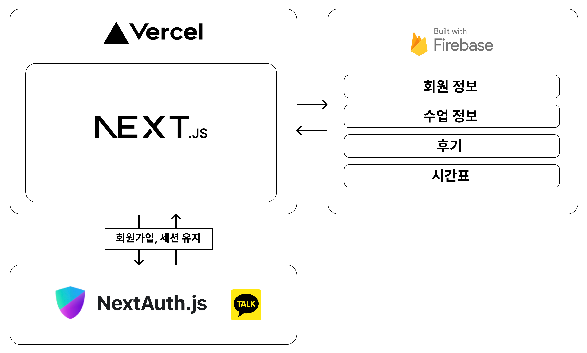

# dyno-english


- [dyno-english](#dyno-english)
  - [소개](#소개)
  - [설치 및 실행](#설치-및-실행)
  - [기술 스택](#기술-스택)
  - [아키텍쳐](#아키텍쳐)
  - [파일 구조](#파일-구조)
  - [구현 기능](#구현-기능)
    - [지도](#지도)
    - [회원 가입](#회원-가입)
    - [후기 작성](#후기-작성)
    - [회원 정보 수정](#회원-정보-수정)
    - [회원 관리](#회원-관리)
    - [수업 관리](#수업-관리)
    - [커리큘럼 관리](#커리큘럼-관리)
    - [공지사항 관리](#공지사항-관리)
    - [시간표 관리](#시간표-관리)

## 소개
- 하남시 미사에 위치한 [다이노 영어](https://naver.me/FNuOZAku)의 웹사이트입니다.
- 다이노 영어의 운영에 필요한 기능들을 구현한 프로젝트입니다.

## 설치 및 실행
**패키지 설치**
```bash
yarn
```

**개발 서버를 실행 및 로컬 환경 접속**
```bash
yarn dev

localhost:3306
```

> **참고**<br />
로컬 환경에서 실행하기 위해서는 db와 연결을 위한 firebase api key, 카카오 로그인을 위한 kakao client id 등이 저장된 `.env` 파일이 필요합니다.<br />
보안 상 이슈로 위 파일은 제공되지 않으며 궁금하신 점이 있는 경우 [issue](https://github.com/gouz7514/dyno-english/issues) 혹은 [메일](mailto:gouz7514@gmail.com)으로 문의해주시길 바랍니다!

## 기술 스택
[](https://skillicons.dev)

## 아키텍쳐

- NextJS와 firebase를 활용했습니다.
- 카카오톡을 기반으로 회원가입을 구현했으며 NextAuth를 사용했습니다.
- 회원 정보, 수업 정보, 후기 등 다이노 영어의 운영에 필요한 데이터는 firestore에 저장됩니다.
  
## 파일 구조
- 크게 `app`, `firebase`, `lib`, `types` 폴더로 나뉩니다.
- `app`
  - `components` : **아토믹 디자인 패턴**을 기반으로 컴포넌트들을 구성했습니다. (참고한 글 : [카카오 FE 기술블로그](https://fe-developers.kakaoent.com/2022/220505-how-page-part-use-atomic-design-system/))
  - NextJs의 [app router](https://nextjs.org/docs/app/building-your-application/routing)를 기반으로 한 페이지 구조를 따릅니다.
- `firebase` : NextJS와 firebase를 연결하기 위한 config 디렉토리입니다.
- `lib` : 자주 사용되는 함수(`utils`), 프로젝트에 사용되는 상수(`constants`) 등을 모아놓은 디렉토리입니다.
- `types` : 프로젝트에서 사용되는 타입 정의를 모아놓은 디렉토리입니다.

## 구현 기능
- 다이노 영어의 회원은 `관리자`와 `일반 회원(학부모)`으로 나뉩니다.
- `관리자`는 `일반 회원`의 정보를 관리할 수 있습니다.
- `관리자`는 수업 정보, 수업 커리큘럼, 공지사항 등을 관리할 수 있습니다.
- `일반 회원`은 수업의 공지사항 및 숙제를 확인할 수 있습니다.
- `일반 회원`은 자녀 정보를 확인 및 수정할 수 있습니다.

### 지도

- 비회원과 회원 모두 확인할 수 있는 지도입니다.
- 다이노 영어를 찾아오는 길을 안내하는 페이지입니다.
- [네이버 지도 API](https://navermaps.github.io/maps.js.ncp/)를 활용해 구현했습니다.

### 회원 가입

- `nextAuth`와 `firebase`를 활용해 구현했습니다.
- 회원 정보는 google cloud platform과 firestore에 저장됩니다.
- 카카오 로그인을 활용했으며 카카오 id를 기반으로 firebase에 회원 정보를 생성합니다.

### 후기 작성

- 후기 작성 가능 권한이 있는 회원은 후기를 작성할 수 있습니다.

### 회원 정보 수정

- 최초 로그인 시 휴대폰 번호와 자녀 정보는 공란입니다.
- 회원은 정보 수정 페이지에서 휴대폰 번호와 자녀 정보를 입력할 수 있습니다.
- 이후 다이앤 선생님이 입력된 자녀를 확인 후 자녀의 수업을 할당합니다.

### 회원 관리

- `관리자`만 접근 가능한 페이지입니다.
- `관리자`는 회원의 정보를 확인하고 후기 작성 권한, 회원의 자녀에 맞는 수업을 지정할 수 있습니다.

### 수업 관리


- `관리자`만 접근 가능한 페이지입니다.
- 새로운 수업을 추가하고 수업 정보를 수정할 수 있습니다.
- 수업에 대해 그날의 숙제, 공지사항을 추가할 수 있습니다.

### 커리큘럼 관리

- `관리자`만 접근 가능한 페이지입니다.
- 수업에 사용할 커리큘럼을 미리 생성하고 수정할 수 있습니다.
- 수업 추가 시 미리 생성된 커리큘럼 중 하나를 선택합니다.

### 공지사항 관리

- `관리자`만 접근 가능한 페이지입니다.
- 회원 정보 수정 페이지에서 나타나는 간단한 공지사항입니다.

### 시간표 관리


- `관리자`만 접근 가능한 페이지입니다.
- 다이노 영어의 주간, 월간 수업 시간표를 관리합니다.
- 반복 조건 설정을 통해 단발성 수업인지, 주기적으로 반복되는 수업인지 설정할 수 있습니다.